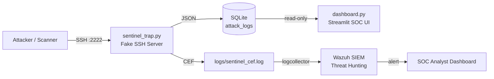
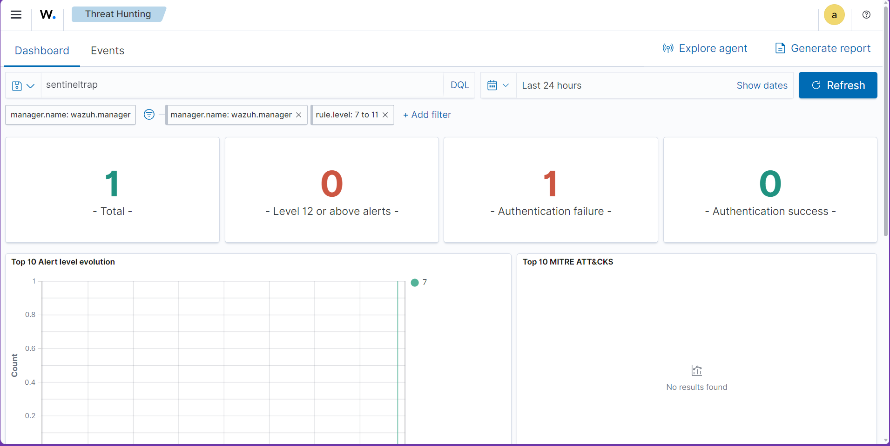
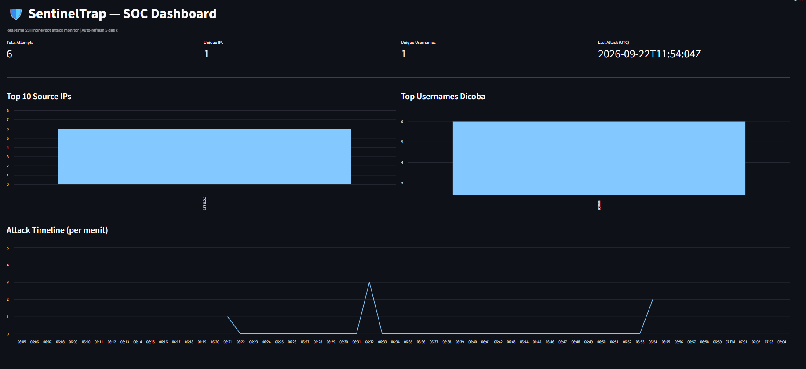

# 🛡️ SentinelTrap — SSH Honeypot & Threat Logger


**Lightweight SSH honeypot** yang menangkap kredensial attacker dan memvisualisasikan pola serangan via dashboard SOC real-time, terintegrasi penuh dengan **Wazuh SIEM** untuk deteksi ancaman end-to-end.

> 🎯 Project portofolio untuk career path **SOC Analyst** — dibangun dari nol dengan pendekatan praktis.

---

## ✨ Features

- 🎣 **Fake SSH service** (Paramiko) yang menjebak & mencatat username/password attacker
- 📝 **Structured JSON logging** — SIEM-ready format untuk analisis forensik
- 🗄️ **SQLite storage** dengan koneksi read-only untuk dashboard (evidence integrity)
- 📊 **Streamlit SOC dashboard**: KPI, Top IPs/Usernames, timeline serangan, export CSV evidence
- 🔌 **CEF log format** — standar industri untuk integrasi SIEM
- 🚨 **Wazuh SIEM integration** dengan custom decoder & rules untuk deteksi brute-force
- 🛡️ **Graceful shutdown** & tahan terhadap disconnect paksa dari scanner/bot

---

## 🏗️ Architecture



---

## 🧰 Tech Stack

- **Honeypot:** Python 3.10+ · Paramiko
- **Database:** SQLite3
- **Dashboard:** Streamlit · Pandas · Plotly
- **SIEM:** Wazuh 4.9 · OpenSearch · Docker Compose
- **Log Format:** CEF (Common Event Format) · JSON

---

## 🚀 Quick Start

### 1. Clone & Setup Environment
```bash
git clone https://github.com/Kurai8s/sentinel-trap.git
cd sentinel-trap
python -m venv venv

# Windows
venv\Scripts\activate

# Linux / macOS
source venv/bin/activate

pip install -r requirements.txt
```

### 2. Run the Honeypot
```bash
python sentinel_trap.py
```
Honeypot akan listening di port **2222** (untuk menghindari konflik dengan SSH asli di port 22).

### 3. Launch the Dashboard
Di terminal terpisah:
```bash
streamlit run dashboard.py
```
Dashboard akan terbuka otomatis di `http://localhost:8501`.

### 4. Test It
```bash
ssh admin@localhost -p 2222
# Password: apa saja (honeypot akan menolaknya & mencatatnya)
```

---

## 📊 Sample Captured Data

**JSON Log (database):**
```json
{
  "timestamp": "2026-09-21T14:03:11Z",
  "source_ip": "127.0.0.1",
  "username": "admin",
  "password": "123456",
  "event_type": "ssh_auth_attempt"
}
```

**CEF Log (SIEM feed):**
```
CEF:0|SentinelTrap|SSH-Honeypot|1.0|1001|SSH Auth Attempt|7|src=127.0.0.1 suser=admin dpt=2222 rt=2026-09-21T14:03:11Z msg=Password captured: 123456
```

---

## 🔌 Wazuh SIEM Integration Lab

SentinelTrap terintegrasi penuh dengan **Wazuh 4.9** melalui pipeline:

```
honeypot → CEF log → logcollector → custom decoder → custom rules → alert
```

### Custom Rules

| Rule ID | Level | Description |
|---------|-------|-------------|
| 100001 | 7 | SSH honeypot credential capture attempt |
| 100002 | 10 | SSH brute-force detected (5 attempts / 2 min) |

### Lab Setup

#### 1. Deploy Wazuh (Docker)
```bash
git clone https://github.com/wazuh/wazuh-docker.git -b v4.9.0 --depth 1
cd wazuh-docker/single-node

# Generate SSL certificates (required)
docker compose -f generate-indexer-certs.yml run --rm generator

# Start Wazuh stack
docker compose up -d
```
Tunggu 2–3 menit untuk indexer bootstrap cluster.

#### 2. Inject Custom Decoder & Rules
```bash
# Copy configuration files ke Wazuh Manager
docker cp wazuh/local_decoder.xml single-node-wazuh.manager-1:/var/ossec/etc/decoders/local_decoder.xml
docker cp wazuh/local_rules.xml single-node-wazuh.manager-1:/var/ossec/etc/rules/local_rules.xml
docker cp wazuh/inject-localfile.sh single-node-wazuh.manager-1:/tmp/inject-localfile.sh

# Inject localfile configuration ke ossec.conf
docker exec single-node-wazuh.manager-1 sh /tmp/inject-localfile.sh

# Reload Wazuh daemon (JANGAN docker restart — config akan ter-wipe)
docker exec single-node-wazuh.manager-1 /var/ossec/bin/wazuh-control restart
```

#### 3. Access Dashboard
- **URL:** https://localhost
- **Username:** `admin`
- **Password:** `SecretPassword`
- **Menu:** Threat Hunting → Search: `SentinelTrap`

> ⚠️ **Penting:** Image Wazuh meregenerasi `ossec.conf` setiap container boot. Langkah inject config & reload daemon perlu diulang setelah `docker compose down -v` atau recreate container.



---

## 📸 Screenshots

### Streamlit SOC Dashboard


### Wazuh SIEM Alert


---

## 🗺️ Roadmap

- [x] SSH honeypot dengan Paramiko
- [x] SQLite logging dengan structured JSON
- [x] Streamlit SOC dashboard (KPI + visualizations)
- [x] CEF log format untuk SIEM integration
- [x] Wazuh SIEM lab dengan custom decoder & rules
- [x] Brute-force detection (Rule 100002, Level 10)
- [ ] Geolocation map attacker (GeoIP integration)
- [ ] Module honeypot HTTP (Apache/Nginx simulation)
- [ ] Module honeypot FTP & Telnet
- [ ] Integrasi Elastic Stack sebagai alternatif SIEM
- [ ] Splunk integration dengan HEC (HTTP Event Collector)

---

## 📁 Project Structure

```
sentinel-trap/
├── sentinel_trap.py          # Honeypot utama (fake SSH server)
├── dashboard.py              # Streamlit SOC dashboard
├── requirements.txt          # Python dependencies
├── .gitignore                # Git ignore rules
├── README.md                 # Dokumentasi project (file ini)
├── wazuh/                    # Konfigurasi Wazuh SIEM
│   ├── local_decoder.xml     # Custom decoder untuk CEF
│   ├── local_rules.xml       # Custom rules 100001 & 100002
│   └── inject-localfile.sh   # Post-start hook untuk ossec.conf
├── assets/                   # Screenshot & gambar
│   ├── dashboard.png
│   └── wazuh-alert.png
├── sentinel_data.db          # SQLite database (gitignored)
├── honeypot_rsa.key          # SSH host key (gitignored)
└── logs/
    └── sentinel_cef.log      # CEF log feed (gitignored)
```

---

## 🔒 Security & Evidence Integrity

- **Database read-only** untuk dashboard: mencegah modifikasi evidence
- **Evidence & private key** tidak masuk Git (via `.gitignore`)
- **Honeypot key persisten** untuk fingerprint SSH yang konsisten
- **Structured logging** dengan timestamp UTC untuk forensik

---

## ⚠️ Disclaimer

> Project ini dibuat untuk tujuan **edukasi & research keamanan siber**. Jangan deploy honeypot di jaringan produksi tanpa isolasi yang memadai dan izin tertulis. Penulis tidak bertanggung jawab atas penyalahgunaan tool ini.

---

## 🤝 Contributing

Pull request dan issue sangat welcome! Untuk perubahan besar, silakan buka issue terlebih dahulu untuk diskusi.

## 📄 License

MIT License — lihat file `LICENSE` untuk detail.

## 👤 Author

**Kurai8s** — Aspiring SOC Analyst building practical cybersecurity portfolio projects.

---

<p align="center">
  <i>"The best way to understand attackers is to watch them in action."</i>
</p>
