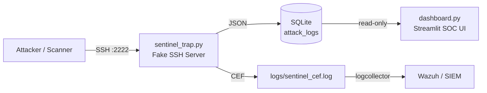

# 🛡️ SentinelTrap — SSH Honeypot & Threat Logger

Lightweight SSH honeypot yang menangkap kredensial attacker dan memvisualisasikan pola serangan via dashboard SOC real-time. Project portofolio untuk career path **SOC Analyst**.

## ✨ Features
- Fake SSH service (Paramiko) yang menjebak & mencatat username/password attacker
- Structured JSON logging (SIEM-ready format)
- SQLite storage dengan koneksi read-only untuk dashboard (evidence integrity)
- Streamlit SOC dashboard: KPI, Top IPs/Usernames, timeline, export CSV evidence
- Graceful shutdown & tahan terhadap disconnect paksa dari scanner/bot

## 🏗️ Architecture

## 🧰 Tech Stack
Python 3 · Paramiko · SQLite · Streamlit · Pandas

## 🚀 Setup
1. `python -m venv venv && venv\Scripts\activate` (Windows) / `source venv/bin/activate` (Linux)
2. `pip install -r requirements.txt`
3. Terminal 1: `python sentinel_trap.py`
4. Terminal 2: `streamlit run dashboard.py`
5. Test: `ssh admin@localhost -p 2222`

## 📊 Sample Captured Log
{"timestamp": "2026-09-21T14:03:11Z", "source_ip": "127.0.0.1", "username": "admin", "password": "123456", "event_type": "ssh_auth_attempt"}

## 🗺️ Roadmap
- [ ] Integrasi SIEM (Wazuh/Elastic) + alert rules
- [ ] Geolocation map attacker
- [ ] Module honeypot HTTP & FTP

## 🔌 SIEM Integration
SentinelTrap menulis log format **CEF (Common Event Format)** ke `logs/sentinel_cef.log`, siap di-ingest SIEM apa pun.

Sample:
`CEF:0|SentinelTrap|SSH-Honeypot|1.0|1001|SSH Auth Attempt|7|src=127.0.0.1 suser=admin dpt=2222 rt=2026-09-21T14:03:11Z msg=Password captured: 123456`

### Wazuh (tambah ke ossec.conf)
<localfile>
  <location>/path/to/sentinel_trap/logs/sentinel_cef.log</location>
  <log_format>syslog</log_format>
</localfile>

## 📸 Dashboard

## ⚠️ Disclaimer
Project edukasi. Jangan deploy di jaringan produksi tanpa isolasi yang memadai.